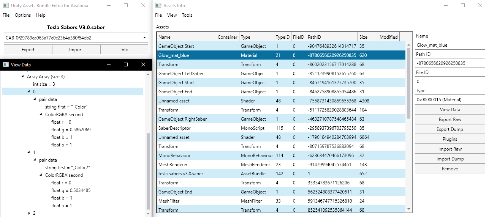

## uabe avalonia

a quick port of uabe to avalonia made in a few days, basic features supported so far but still tons missing. for now you can only import and export assets and modify bundles, everything else is not supported.

I made this so I can easily edit assets in newer unity games (import/export raw and dump). it's not really finished yet and probably not useful to most people.

this project is made with avalonia so you can run it pretty much anywhere instead of being windows dependent, but avalonia turned out to be kind of hard to develop with so I apologize in advance for the bad code and hacks.

supported unity versions: **5 - 2020.2**

todo (basically everything)

* any error checking
* add / remove assets
* asset list searching
* dependency loading (including data view)
* monobehaviour deserialization in data view
* everything bundles (packing, importing, etc)
* plugin support and plugins themselves
* implement the features that are going to be in [new uabe](https://community.7daystodie.com/topic/1871-unity-assets-bundle-extractor/?do=findComment&comment=357397)

a random beat saber saber's bundle I found:

